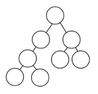

# TinyFiber

This repository was created for me to learn react fiber, it's a rough mockup of how fiber works, but it helps me understand the idle time and how fiber works very well

just clone this repository and

```shell
npm install
npm run start
```

this repository has two entries, one is client entry `src/index.js`, another one is server entry `server.js`. It is easy to understand, hope it helps you

The next sections are the steps to build this project

### 1. Development environment configuration

#### 1.1 File structure

| 文件 / 文件夹            | 描述                            |
| ------------------------ | ------------------------------- |
| src                      | Client source files             |
| dist                     | Client-side bundle code         |
| build                    | Server-side bundle code         |
| server.js                | Server source file              |
| webpack.config.server.js | Server-side webpack config file |
| webpack.config.client.js | Client-side webpack config file |
| babel.config.json        | Babel config                    |
| package.json             | Project metadata file           |

Init `package.json` ：`npm init -y`

#### 1.2 Install project dependencies

Dependencies at development：`npm install webpack webpack-cli webpack-node-externals @babel/core @babel/preset-env @babel/preset-react babel-loader nodemon npm-run-all -D`

Project dependencies：`npm install express`

| 依赖项                 | 描述                                                         |
| ---------------------- | ------------------------------------------------------------ |
| webpack                | Module Packaging Tool                                        |
| webpack-cli            | Package command tool                                         |
| webpack-node-externals | Exclude modules from the node_modules folder when packaging server-side modules |
| @babel/core            | JavaScript code conversion tools                             |
| @babel/preset-env      | babel Presets, Converting Advanced JavaScript Syntax         |
| @babel/preset-react    | babel Presets, Converting JSX syntax                         |
| babel-loader           | The babel tool loader in webpack                             |
| nodemon                | Monitor server-side file changes and restart the application |
| npm-run-all            | Command line tool that can execute multiple commands at the same time |
| express                | node platform-based web development framework                |

#### 1.3 Environment Configuration

##### 1.3.1 Creating a web server

```javascript
// server.js
import express from 'express'
const app = express()
app.use(express.static('dist'))
const template = `
  <html>
    <head>
      <title>React Fiber</title>
    </head>
    <body>
      <div id="root"></div>
			<script src="bundle.js"></script>
    </body>
  </html>
`
app.get('*', (req, res) => {
  res.send(template)
})
app.listen(3000, () => console.log('server is running'))
```

##### 1.3.2 Server-side webpack configuration

```javascript
// webpack.config.server.js
const path = require('path')
const nodeExternals = require('webpack-node-externals')

module.exports = {
  target: 'node',
  mode: 'development',
  entry: './server.js',
  output: {
    filename: 'server.js',
    path: path.resolve(__dirname, 'build'),
  },
  module: {
    rules: [
      {
        test: /\.js$/,
        exclude: /node_modules/,
        use: {
          loader: 'babel-loader',
        },
      },
    ],
  },
  externals: [nodeExternals()],
}
```

##### 1.3.3 babel configuration

```javascript
// babelrc.json
{
  "presets": ["@babel/preset-env", "@babel/preset-react"]
}
// or babel.config.js
module.exports = {
  "presets": ["@babel/preset-env", "@babel/preset-react"]
}
```

##### 1.3.4 Client-side webpack configuration

```javascript
// webpack.config.client.js
const path = require('path')

module.exports = {
  target: 'web',
  mode: 'development',
  entry: './src/index.js',
  output: {
    filename: 'bundle.js',
    path: path.resolve(__dirname, 'dist'),
  },
  devtool: 'source-map',
  module: {
    rules: [
      {
        test: /\.js$/,
        exclude: /node_modules/,
        use: {
          loader: 'babel-loader',
        },
      },
    ],
  },
}
```

##### 1.3.5 Start command

```json
"scripts": {
  "start": "npm-run-all --parallel dev:*",
  "dev:server-compile": "webpack --config webpack.config.server.js --watch",
  "dev:server": "nodemon ./build/server.js",
  "dev:client-compile": "webpack --config webpack.config.client.js --watch"
},
```

### 2. requestIdleCallback

#### 2.1 Core API Features

Take advantage of the browser's idle periods to execute tasks, and if there is a higher priority task to execute, the currently executing task can be terminated to give priority to the high-level task.

```javascript
requestIdleCallback(function (deadline) {
  // deadline.timeRemaining() 获取浏览器的空余时间
})
```

#### 2.2 Browser's idle periods

The page is drawn frame by frame, when the number of frames per second reaches 60, the page is smooth, less than this value, the user will feel the lag

1s 60 frames, the time allocated to each frame is 1000/60 ≈ 16 ms, if the execution time of each frame is less than 16ms, it means that the browser has free time

If the task does not complete in the idle periods, it will stop and continue to execute the main task first, i.e. requestIdleCallback always uses the browser's idle periods to execute the task.

#### 2.3 API Feature Experience

There are two buttons and a DIV on the page. Clicking on the first button performs an expensive calculation that takes up the main thread for a long time, and while the calculation task is being performed click on the second button to change the background color of the DIV on the page and you will feel stuck.

```html
<!DOCTYPE html>
<html lang="en">
  <head>
    <meta charset="UTF-8" />
    <meta name="viewport" content="width=device-width, initial-scale=1.0" />
    <title>Document</title>
    <style>
      #box {
        padding: 20px;
        background: palegoldenrod;
      }
    </style>
  </head>
  <body>
    <div id="box"></div>
    <button id="btn1">Performing computing tasks</button>
    <button id="btn2">Change background color</button>
    <script>
      var box = document.getElementById("box")
      var btn1 = document.getElementById("btn1")
      var btn2 = document.getElementById("btn2")
      var number = 99999
      var value = 0

      // Expensive calculations
      function calc(deadline) {
        while (number > 0 && deadline.timeRemaining() > 1) {
          value = Math.random() < 0.5 ? Math.random() : Math.random()
          console.log(value)
          number--
        }
        requestIdleCallback(calc)
      }

      btn1.onclick = function () {
        requestIdleCallback(calc)
      }

      btn2.onclick = function () {
        box.style.background = "green"
      }
    </script>
  </body>
</html>
```

Using requestIdleCallback solves this stalling problem perfectly.

```html
<div class="playground" id="play">playground</div>
<button id="work">start work</button>
<button id="interaction">handle some user interaction</button>
```

```css
<style>
  .playground {
    background: palevioletred;
    padding: 20px;
    margin-bottom: 10px;
  }
</style>
```

```javascript
var play = document.getElementById('play')
var workBtn = document.getElementById('work')
var interactionBtn = document.getElementById('interaction')
var iterationCount = 100000000
var value = 0

var expensiveCalculation = function (IdleDeadline) {
  while (iterationCount > 0 && IdleDeadline.timeRemaining() > 1) {
    value = Math.random() < 0.5 ? value + Math.random() : value + Math.random()
    iterationCount = iterationCount - 1
  }
  requestIdleCallback(expensiveCalculation) // if above loop break, we need to call it again
}

workBtn.addEventListener('click', function () {
  requestIdleCallback(expensiveCalculation)
})

interactionBtn.addEventListener('click', function () {
  play.style.background = 'palegreen'
})
```

### 3 Fiber

#### 3.1 Issues

The process of comparing and updating the VirtualDOM in previous versions of React 16 was implemented using a loop with recursion, which had the problem that once a task was started it could not be interrupted. The main thread can only perform other tasks. This will lead to some user interaction, animation and other tasks can not be executed immediately, and the page will be stuck, which will affect the user experience.

The core problem: recursion cannot be interrupted, and it takes a long time to execute heavy tasks. JavaScript is single-threaded and cannot execute other tasks at the same time, resulting in delayed page lag and poor user experience.

#### 3.2 Solutions

1. use browser idle time to execute tasks, and refuse to occupy the main thread for a long time
2. abandon recursion and use only loops, because loops can be interrupted
3. task splitting, splitting the task into smaller tasks

The core is the first point, the second and third points are to achieve the first point

#### 3.3 实现思路

In the Fiber scenario, the DOM diff algorithm is divided into two parts in order to enable the termination and continuation of tasks.

1. build Fiber (interruptible)
2. committing Commit (non-interruptible)

DOM Initial rendering: `virtualDOM -> Fiber -> Fiber[] -> DOM`

DOM Update rendering: `newFiber vs oldFiber -> Fiber[] -> DOM`

The original virtual DOM is a tree structure, but now it needs to be divided into arrays of small Fiber objects to adapt to the new diff architecture. The node relationships of the original tree are smoothed out in the array, but there are still relationships between the nodes when building the DOM, so the Fiber node object needs to store the nodes it has relationships with.

#### 3.4 Fiber Object

Fiber objects are ordinary JavaScript objects

```
{
  type         Node type (element, text, component) (specific type)
  props        Node Properties
  stateNode    Node real DOM object | Component instance object
  tag          Node tag (classification of specific types hostRoot || hostComponent || classComponent || functionComponent)
  effects      Array, storing the fiber objects to be changed
  effectTag    The current Fiber action to be performed (add, delete, modify)
  parent       The parent Fiber of the current Fiber
  child        Sublevel Fiber of the current Fiber
  sibling      The sibling Fiber of the current Fiber
  alternate    Fiber backups are used for fiber comparison
}
```



